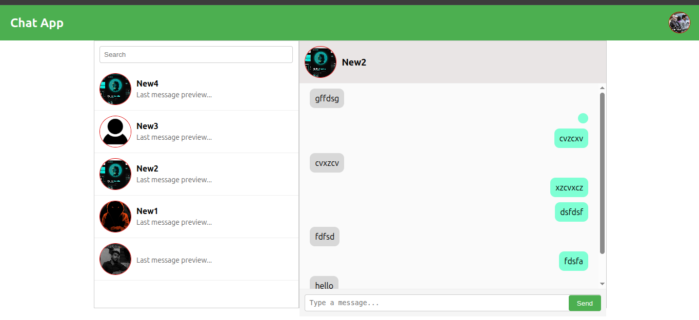

# ChatApp With Django and React


A real-time private chat web application built with **Django**, **Django Channels**, and **React.js**.  
It supports **JWT Authentication**, **Private Rooms**, **Active User Status**, and **Real-time Messaging** via WebSockets.

> Created by: [@b1ack-devi1](https://github.com/b1ack-devi1)

---

##  Features

-  **JWT Authentication** (login/signup)
-  **Private 1-to-1 chat rooms**
-  **Real-time communication** using Django Channels & WebSockets
-  **Active user status** indicator
-  **Messages saved** in database
-  **Modern React frontend** (Vite + Tailwind)
-  **Redis-powered backend** for instant message delivery

---

##  Preview



##  Installation
- Clone the repository:	
   ```bash
   https://github.com/b1ack-devi1/ChatApp-With-Django-and-React.git
   cd ChatApp-With-Django-and-React
   ```
- Backend Setup (Django):
  ```bash
  cd Back_end
  python -m venv env
  source env/bin/activate (for linux)
  pip install -r r.txt
  ```
- Create and apply migrations:
  ```bash
    python manage.py makemigrations
    python manage.py migrate
  ```


## 🛡️ License

This project is open-source and available under the MIT License.

----------

## 🙌 Acknowledgements

-   [Django]()
    
-   [React]() 
    

----------

## 🌐 Connect
  
🔗 GitHub: [@b1ack-devi1](https://github.com/b1ack-devi1)
